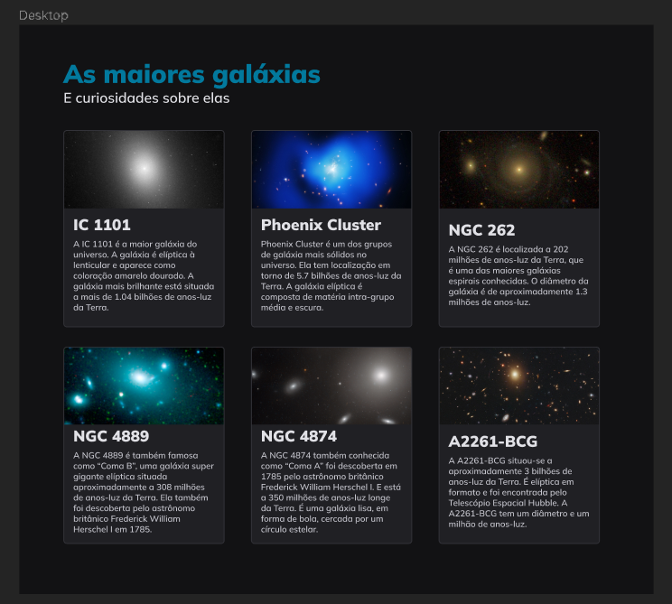

  

## 💻 Projeto  
Esse é um projeto Web de uma página que demonstra curiosidades sobre Galáxias.

## 🚀 Tecnologias
Esse projeto foi desenvolvido durante o curso da Rocketseat com as seguintes tecnologias:

- HTML
- CSS (Grid);

## 🏷️ Layout
Você pode visualizar o layout do projeto através [desse link](https://www.figma.com/file/ieBjhQG21VatLegi00a9nb/Galaxies-%E2%80%A2-Projeto-Explorer-(Community)?type=design&node-id=0-755&mode=design&t=LenbXqGnJjmm497Z-0).
É necessário ter uma conta no [Figma](https://www.figma.com/).
